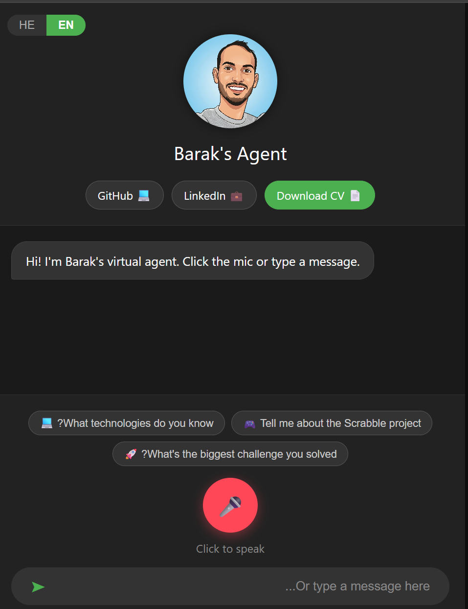
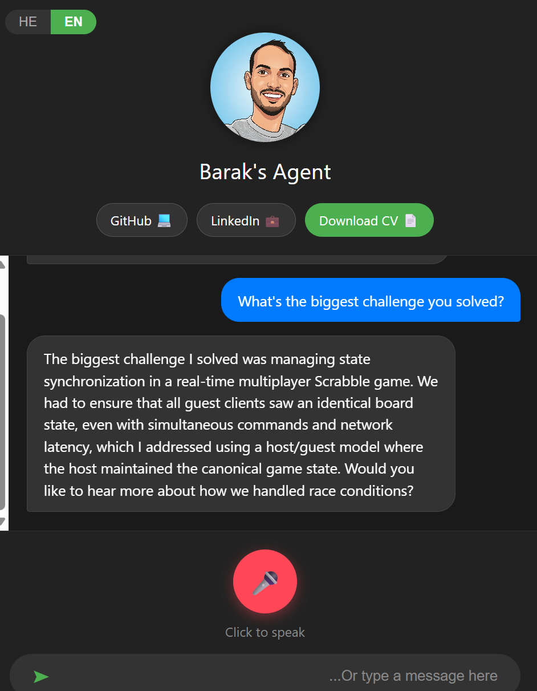

# AI Interview Agent (Barak Ben Acon)

A production-style AI interview assistant I built to represent my professional profile in real-time conversations.  
The project supports both:

- **Web/API chat** (FastAPI backend + browser frontend)
- **Local voice interview simulation** (microphone input + spoken responses)

It is designed for interview demos, portfolio presentation, and conversational CV exploration in Hebrew/English.

---

## Why this project exists

I wanted a practical way to present my experience beyond a static resume.  
This assistant answers recruiter-style questions using my CV and project knowledge, keeps multi-session context, generates speech, and logs conversations for review.

---

## Screenshots

### Home Screen


### Live Chat Example


## Core capabilities

- Multi-session AI chat with persistent session state
- Dynamic model/client rotation for better reliability under load
- Auto-retry on quota/rate-limit errors
- Hebrew + English response mode
- Optional TTS audio generation (Microsoft Edge TTS)
- Voice-enabled local mode (speech-to-text + text-to-speech)
- Load testing script for concurrent user simulation
- Session-based logging with date-organized files

---

## Project structure

- `main.py` — Main FastAPI server (chat endpoint, TTS, logs, session management)
- `static/index.html` — Frontend page served by FastAPI
- `tests/test_load.py` — Simple load test for 10 simulated users
- `data/cv.txt` — Resume source text
- `data/knowledge_base.txt` — Main project/context knowledge
- `data/scrabble.txt`, `data/sokuban and classification.txt` — Additional domain knowledge
- `logs/` — Session log files (created automatically)
- `docs/` — Project notes/history documents
- `scripts/` — Utility scripts

---

## Tech stack

- Python 3.10+
- FastAPI + Uvicorn
- Google GenAI SDK (Gemini models)
- edge-tts (audio generation)
- SpeechRecognition + gTTS + pygame (local voice mode)
- requests (load testing)

---

## Setup

### 1) Install dependencies

```bash
pip install -r requirements.txt
```

### 2) Configure environment variables (recommended)

Even though fallback defaults exist in code, I recommend setting keys via environment:

```bash
# Required
export GEMINI_API_KEY="your_key"

# Optional pool for rotation
export GEMINI_API_KEY_1="your_key_1"
export GEMINI_API_KEY_2="your_key_2"
export GEMINI_API_KEY_3="your_key_3"

# Optional admin secret for logs endpoint
export ADMIN_SECRET="your_admin_secret"
```

> On Windows PowerShell, use `$env:VAR_NAME="value"`.

---

## Running the project

### Run API server

```bash
python main.py
```

Server will start on `http://0.0.0.0:8000`.

### Open frontend

- Open `http://127.0.0.1:8000` in browser.

## API overview

### `POST /api/chat`

Request body:

```json
{
  "session_id": "test_user_1",
  "message": "Tell me about your DevOps experience",
  "language": "en",
  "text_only": false
}
```

Response:

```json
{
  "text": "response text...",
  "audio_ready": true
}
```

### `GET /api/audio/{session_id}`

Returns generated MP3 for the session (if available).

### `GET /api/logs?secret=...`

Returns collected chat history (protected by `ADMIN_SECRET`).

---

## Load testing

Run:

```bash
python tests/test_load.py
```

This simulates 10 users calling `/api/chat` with `text_only=true`.

---

## Logging behavior

Each session is logged into:

- `logs/YYYY-MM-DD_<session_id>.txt`

This makes it easy to inspect interview flows by user and date.

---

## Notes and limitations

- Some API keys are currently hardcoded in source; environment variables are safer.
- `logs/` and generated audio files can grow over time — periodic cleanup is recommended.
- Voice quality/latency depends on network and TTS provider availability.

---

## Suggested next improvements

- Move all secrets to `.env` + secrets manager
- Add authentication/rate limiting for public deployment
- Add Dockerfile + docker-compose for easy deployment
- Add structured logging + monitoring (e.g., Prometheus/Grafana)
- Add unit/integration tests around API endpoints
- Add CI pipeline for lint/test/deploy

---

## License

Personal project / portfolio usage.